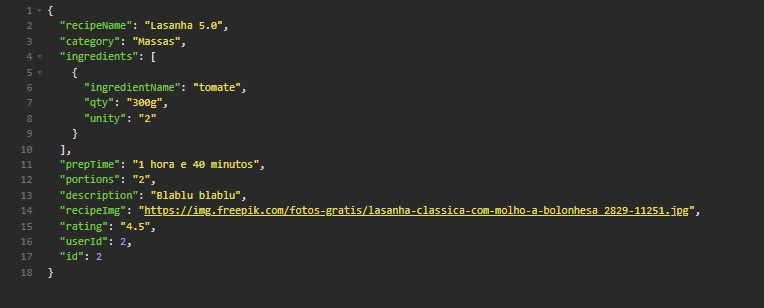

MyRecipes FakeApi - Funcionalidades:

### Register

POST /register

Campos obrigatórios: username, email e password.
Endpoint usado para cadastro de novos usuários

Formato da resposta - STATUS 201 CREATED

### Login

POST /login

Campos obrigatórios: email e password.
Endpoint pode ser usado para realizar login com um dos usuários cadastrados na lista de "Users"]

Formato da resposta - STATUS 200 OK

### All Users

GET /users

Endpoint usado para fazer autenticação de rotas, necessita autenticação atravéz de um token

Formato da resposta - STATUS 200 OK

### Profile

GET /users/id

Endpoint usado para buscar informações de um usuário especifico e suas receitas, necessita autenticação através de um token

Formato da resposta - STATUS 200 OK

### Register Recipe

POST /recipes

Endpoint usado para cadastrar uma nova receita de um usuário específico, necessita autenticação através de um token

Formato da resposta - STATUS 201 CREATED

### Edit Recipe

PATCH /recipes/recipeId

Endpoit usado para editar a receita de um usuário específico, necessita autenticação através de um token

Formato da resposta - STATUS 200 OK

### All Recipes

GET /recipes

Endpoint usado para buscar todas as receitas sem necessidade de autenticação através de um token

Formato da resposta - STATUS 200 OK

### Delete Recipe

DEL /recipes/recipeId

Endpoint usado para excluir uma receita específica, somente quem criou a receita pode excluir, necessita autenticação através de um token

Formato da resposta - STATUS 200 OK

{}
